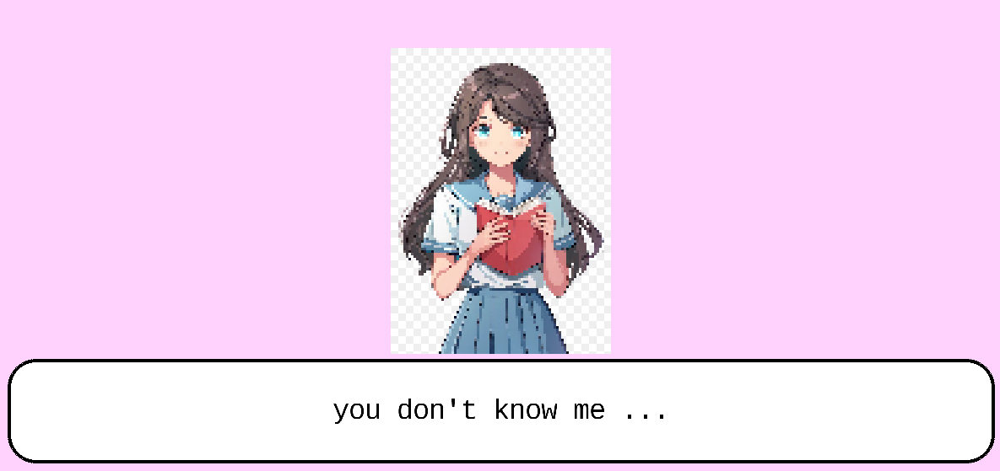

# Entry 3
##### 2/3/25

## Content 
So as you may know we have this project called the Freedom Project which is our year-long project. We picked a tool that we wanted to use and made a game out of it. So what I decided to pick was kaboom js. I have been using this tool by using [kaboom website](https://kaboomjs.com/) in this website you are allowed to see the codes you can use and you can go to the playground which has games and codes for those games. Another thing I used was the [learning log](../tool/learning-log.md) Here you can see all the processes I have done. So before break, we had to write a blog in which I explained everything I was going to do during break. Everything I did during break you can see here:
## What I did during the break
So I made a thing where you can talk to people and it changes the character on the screen when you do. The code is here:
````` js
kaboom({
	background: [ 255, 209, 253 ],
})

loadSprite("bean", "/sprites/../person.png")
loadSprite("mark", "/sprites/../women.png")

// Define the dialogue data
const dialogs = [
	[ "bean", "hi my butterfly" ],
	[ "bean", "i love u" ],
	[ "bean", "you love me? pretty baby" ],
	[ "bean", "he did not know how to take care of you..." ],
	[ "mark", "you don't know me ..." ],
	[ "bean", "what! baby???" ],
	[ "mark", "oh...hi " ],
]

let curDialog = 0

// Text bubble
const textbox = add([
	rect(width() - 200, 120, { radius: 32 }),
	anchor("center"),
	pos(center().x, height() - 100),
	outline(4),
])

// Text
const txt = add([
	text("", { size: 32, width: width() - 230, align: "center" }),
	pos(textbox.pos),
	anchor("center"),
	color(0, 0, 0),
])

// Character avatar
const avatar = add([
	sprite("bean"),
	scale(3),
	anchor("center"),
	pos(center().sub(0, 50)),
])

onKeyPress("space", () => {
	// Cycle through the dialogs
	curDialog = (curDialog + 1) % dialogs.length
	updateDialog()
})

// Update the on-screen sprite & text
function updateDialog() {

	const [ char, dialog ] = dialogs[curDialog]

	// Use a new sprite component to replace the old 
	avatar.use(sprite(char))
	// Update the dialog text
	txt.text = dialog

}

updateDialog()


`````




As you can see above the people are talking to each other.


### Plans
So the first thing we need to do is combine this with Katherine thing. So we can have a game where you can go through levels and talk to people. After we add more levels, make it so that when you press space you talk to people and esc to leave the talking. These are some of the plans we have and that we still need to work on. 

## Engineering Design Process
The Engineering Design process is the part of the project you are on. So I am currently on the fifth Engineering Design process which is create, so the problem we are fixing is that people are too scared to cook. So maybe they would want to cook online, what we are doing is making a game where people can cook, make their own way of cooking, serving customers, and having fun with friends. So far we have made a prototype where my teammate has made the levels and I have made it so you can talk to people. This is our prototype so far, we need to make improvements and add more things to do in the game. therefore the step we are on is the create step which is making a prototype of the game which we made a part of the game so far. 

## Skills 

## Researching
One of the most important parts is the research. I had to do a lot of searches to find what I was looking for. There were many codes that I had to find, so I had to research hard and long until I found the right codes. After that, I also had to find pictures that I could use for the code and find ways to use the code. This is why research is important: You find stuff that you really need. 

## Communication 
Communication is really important as you during the break I needed to talk with my teammate since we needed to get work done. I had to talk to them when I needed help and when they wanted help. This got us through a lot as when we didn't understand something we just asked each other. Also when we were working together I had to ask what the code was looking at and what we should do and not do. During the break, we couldn't talk in school as there was no school. So communication is one of the most important skills that we should all know and it would be helpful in the future since later on you have to talk with others.


[Previous](entry02.md) | [Next](entry04.md)

[Home](../README.md)


