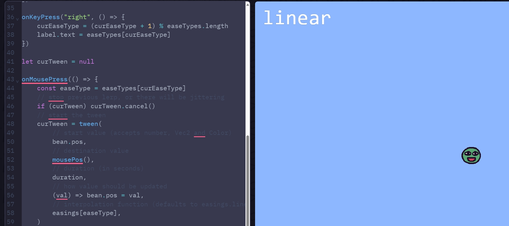
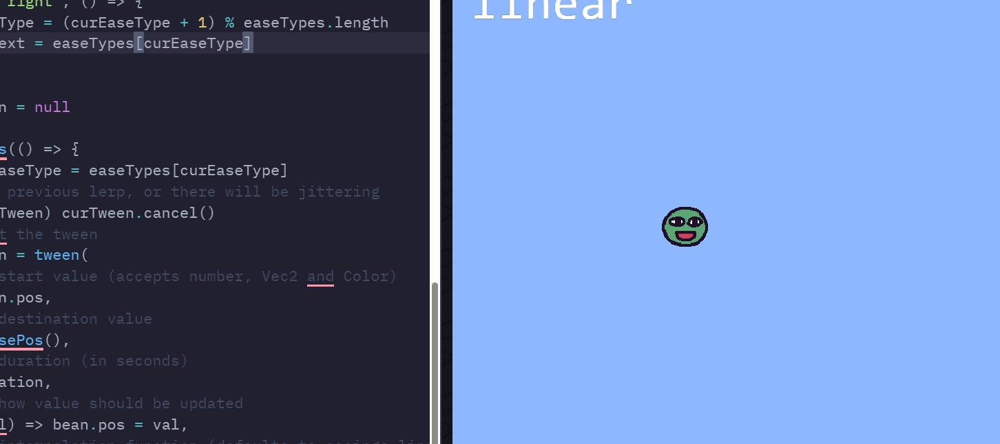

# Entry 4
##### 3/163/25

## Content 
This is my blog 4. So as you may know we have this project called the Freedom Project which is our year-long project. We picked a tool that we wanted to use and made a game out of it or whatever we wanted. So what I decided to pick was kaboom js. I have been using this tool by using [kaboom website](https://kaboomjs.com/) in this website you are allowed to see the codes you can use and you can go to the playground which has games and codes for those games. Another thing I used was the [learning log](../tool/learning-log.md) Here you can see all the LL I have done. So we had a break and we did some stuff but most of what I have done is for my LL.

## My LL 7-9
So something I have been learning is how to move the character in different ways, and also how to use different keys when trying to play a game. What I mean by this is when you press w you move up or when you press left mouse you attack or something so I have been driving deeper into this and learned:
`````js
// Tweeeeeening!

kaboom({
	background: [141, 183, 255],
})

loadSprite("bean", "/sprites/bean.png")

const duration = 1
const easeTypes = Object.keys(easings)
let curEaseType = 0

const bean = add([
	sprite("bean"),
	pos(center()),
	rotate(0),
	anchor("center"),
])

const label = add([
	text(easeTypes[curEaseType], { size: 64 }),
	pos(24, 24),
])

add([
	text("Click anywhere & use arrow keys", { width: width() }),
	anchor("botleft"),
	pos(24, height() - 24),
])

onKeyPress("left", () => {
	curEaseType = curEaseType === 0 ? easeTypes.length - 1 : curEaseType - 1
	label.text = easeTypes[curEaseType]
})

onKeyPress("right", () => {
	curEaseType = (curEaseType + 1) % easeTypes.length
	label.text = easeTypes[curEaseType]
})

let curTween = null

onMousePress(() => {
	const easeType = easeTypes[curEaseType]
	// stop previous lerp, or there will be jittering
	if (curTween) curTween.cancel()
	// start the tween
	curTween = tween(
		// start value (accepts number, Vec2, and Color)
		bean.pos,
		// destination value
		mouses(),
		// duration (in seconds)
		duration,
		// how value should be updated
		(val) => bean.pos = val,
		// interpolation function (defaults to easings.linear)
		easings[easeType],
	)
})
`````




This shows that I have been trying to learn how to move and make other keys do different things. 


### Future and MVP

So far we learned how to move a character, how to make different keys do different things, and make different maps, what we need to do for the future is add texture, make it so the person can cook, and make NPC where they can ask different things. This is what we need to do for the future. 

## Engineering Design Process
The Engineering Design process is the part of the project you are on. I am currently on the fifth Engineering Design process which is created, so the problem we are fixing is that people are too scared to cook. So we are making a game where you can cook online, so you can learn it online first, and you can have brust cooking with friends. So far we have made a prototype where my teammate has made the levels and I have made it so you can talk to people. Also, made it so you can move the characters and make different keys do different stuff. This is our prototype so far, we need to make improvements and add more things to do in the game. Therefore the step we are on is the create step which is making a prototype of the game which we are doing more a more each day. We will almost be done with the project. 

## Skills 

## Researching
Researching is a really important part, I had to research how to use kaboom, and find pictures. Sometimes when I am trying to find a picture I can't so I had to improve my researching and type in more so that I can find what I am looking for. This was important because let's stay I was trying to find a part of Kaboom I didn't know I couldn't just search Kaboom and find what I am looking for I needed to search Kaboom mousepress or something like that to find the code I was looking for. So I learned that this is important.

## Communication 
Another thing I learned is how important communication is, when you are working with a teammate you need to communicate because if you don't it is hard to know what your partner is thinking and what you should be doing. During this, I ask what my partner is doing and we both learn different things so we can finish faster. Also, communication is useful when you need help like when I having trouble learning something I can ask people for help this is important because if Google can't help me maybe someone else can. So communication is really important and it can be helpful in the future, you should always be communicated so communication is really important and is a skill that we should use and do for everything it is helpful and easy to finish when you talk to someone.


[Previous](entry03.md) | [Next](entry05.md)

[Home](../README.md)
