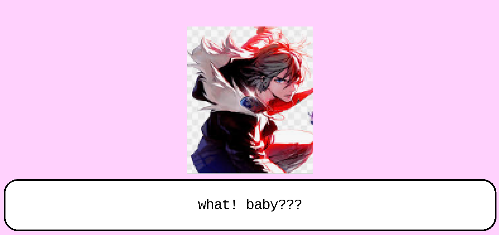

# Tool Learning Log

## Tool: **Kaboom**

## Project: **Cooking game**

---

### 10/6/24:
Using kaboom for the first time,
So to start off I had to learn how to instead it first;
The code to instead kaboom is

`````
<script type="module">

// import kaboom.js
import kaboom from "https://unpkg.com/kaboom@3000.0.1/dist/kaboom.mjs";

// initialize kaboom context
kaboom();

// add a piece of text at position (120, 80)
add([
    text("hello"),
    pos(120, 80),
]);

</script>
`````
This is one way of insteading, if you instead this way there will be text and you can change teh sides of the background. 



### X/X/XX:
* Text


<!-- 
* Links you used today (websites, videos, etc)
* Things you tried, progress you made, etc
* Challenges, a-ha moments, etc
* Questions you still have
* What you're going to try next
-->
