# Tool Learning Log

## Tool: **Kaboom**

## Project: **Cooking game**

---

### 10/6/24:
Using kaboom for the first time,
So to start off I had to learn how to instead it first;
The code to instead kaboom is

`````js
<script type="module">

// import kaboom.js
import kaboom from "https://unpkg.com/kaboom@3000.0.1/dist/kaboom.mjs";

// initialize kaboom context
kaboom();

// add a piece of text at position (120, 80)
add([
    text("hello"),
    pos(120, 80),
]);

</script>
`````
This is one way of insteading, if you instead this way there will be text and you can change the sides of the background. 
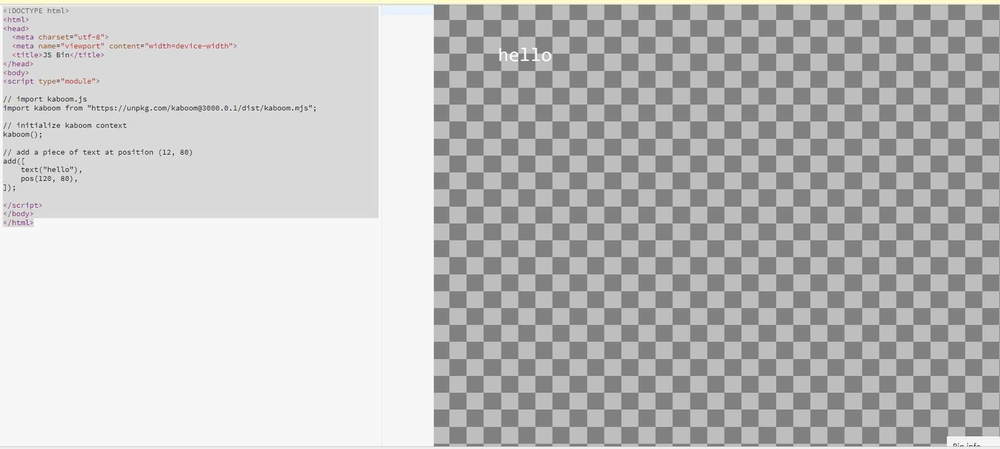

The other way of insteading it is the same but there aren't any words. 
````js
<script src="https://unpkg.com/kaboom@3000.0.1/dist/kaboom.js"></script>

<script>
    kaboom();
</script>
````
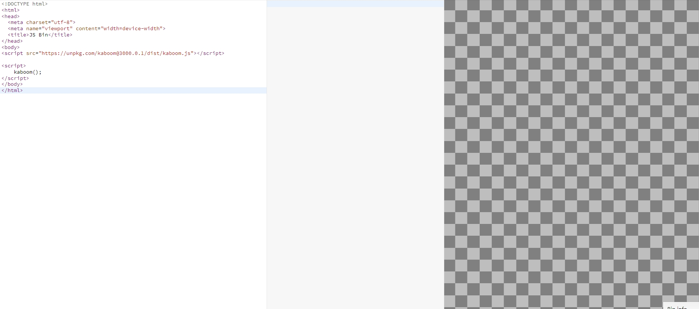

So after doing my research on Kaboom I learned many things and combined them. So somethings that I added to this is sprite which is the character of this game. Another thing I added was const which makes everything the same. another example of this is 
`````js 
const Speed =320
`````

Another thing I learned was onKeyDown, which makes it so when one key is down something will happen. For example:

`````js
onKeyDown("left", () => {
	player.move(-SPEED, 0)
})

onKeyDown("right", () => {
	player.move(SPEED, 0)
})

onKeyDown("up", () => {
	player.move(0, -SPEED)
})

onKeyDown("down", () => {
	player.move(0, SPEED)
})

onKeyDown("q", () => {
	player.angle -= SPEED * dt()
})

onKeyDown("e", () => {
	player.angle += SPEED * dt()
})
`````
Another thing I added was add a sprite with a mass that you can move:
`````js
add([
	sprite("steel"),
	pos(100, 200),
	area(),
	// This will not be static, but have a big mass that's hard to push over
	body({ mass: 10 }),
])
`````
Last code I have for my tinkering is:
`````js
player.onCollide("enemy", (enemy) => {
	destroy(enemy)
})

// .onCollideUpdate() runs every frame when an object collides with another object
player.onCollideUpdate("enemy", () => {
})
`````

So combining all these codes I came up with a test paceman game:

`````Js 
// Collision handling

// Start kaboom
kaboom({
	scale: 2,
})

// Load assets
loadSprite("bean", "/sprites/bean.png")
loadSprite("ghosty", "/sprites/ghosty.png")
loadSprite("grass", "/sprites/grass.png")
loadSprite("steel", "/sprites/steel.png")

// Define player movement speed
const SPEED = 320

// Add player game object
const player = add([
	sprite("bean"),
	pos(80, 120),
	color(),
	rotate(0),

	area(),

	body(),
])


onKeyDown("left", () => {
	player.move(-SPEED, 0)
})

onKeyDown("right", () => {
	player.move(SPEED, 0)
})

onKeyDown("up", () => {
	player.move(0, -SPEED)
})

onKeyDown("down", () => {
	player.move(0, SPEED)
})

onKeyDown("q", () => {
	player.angle -= SPEED * dt()
})

onKeyDown("e", () => {
	player.angle += SPEED * dt()
})


for (let i = 0; i < 3; i++) {

	const x = rand(0, width())
	const y = rand(0, height())

	add([
		sprite("ghosty"),
		pos(x, y),
		area(),
		"enemy",
	])

}


add([
	sprite("steel"),
	pos(100, 200),
	area(),
	body({ mass: 10 }),
])

add([
	sprite("steel"),
	pos(100, 200),
	area(),
	body({ mass: 10 }),
])

add([
	sprite("steel"),
	pos(100, 200),
	area(),
	body({ mass: 10 }),
])
add([
	sprite("steel"),
	pos(250, 320),
	area(),
	body({ mass: 10 }),
])
add([
	sprite("steel"),
	pos(200, 300),
	area(),
	body({ mass: 10 }),
])
add([
	sprite("steel"),
	pos(300, 100),
	area(),
	body({ mass: 10 }),
])

add([
	sprite("steel"),
	pos(10, 200),
	area(),
	body({ mass: 10 }),
])
add([
	sprite("steel"),
	pos(150, 200),
	area(),
	body({ mass: 10 }),
])

add([
	sprite("steel"),
	pos(300, 50),
	area(),
	body({ mass: 10 }),
])


	destroy(enemy)
})

player.onCollideUpdate("enemy", () => {
})

player.onCollideEnd("grass", (a) => {
	debug.log("leave grass")
})

player.onClick(() => {
	debug.log("what up")
})

player.onUpdate(() => {
	hovered on
	if (player.isHovering()) {
		player.color = rgb(0, 0, 255)
	} else {
		player.color = rgb()
	}
})


debug.inspect = true

`````
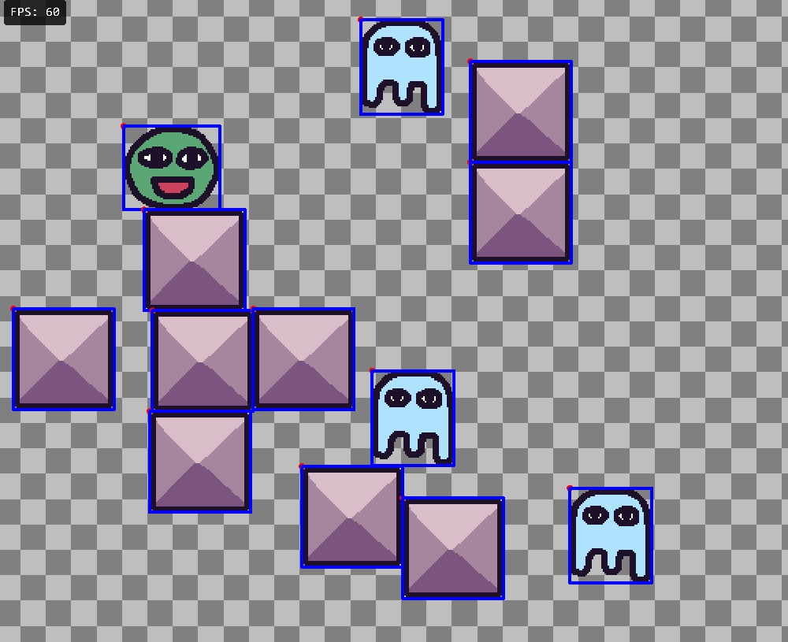
So as you can see here I used all the code I needed for a fake pacman game. You can move and eat the ghost. This is what I did for LL1.


## 10/27/24
## LL2

I started to play around the Ai in kaboom. You are able to make an enemy shoot you. 
The code I had for this is 
`````js
const enemy = add([
	sprite("ghosty"),
	pos(width() - 80, height() - 80),
	anchor("center"),
	// This enemy cycle between 3 states, and start from "idle" state
	state("move", [ "idle", "attack", "move" ]),
	area(),
	body(),
])
`````
This adds an enemy into your game.
The next code I did was:
`````js
enemy.onStateEnter("idle", async () => {
	await wait(0.5)
	enemy.enterState("attack")
})

// When we enter "attack" state, we fire a bullet, and enter "move" state after 1 sec
enemy.onStateEnter("attack", async () => {

	// Don't do anything if player doesn't exist anymore
	if (player.exists()) {

		const dir = player.pos.sub(enemy.pos).unit()

		add([
			pos(enemy.pos),
			move(dir, BULLET_SPEED),
			rect(12, 12),
			area(),
			offscreen({ destroy: true }),
			anchor("center"),
			color(BLUE),
			"bullet",
		])

	}

	await wait(1)
	enemy.enterState("move")

})

enemy.onStateEnter("move", async () => {
	await wait(2)
	enemy.enterState("idle")
})
`````
This allows the enemy to shoot at people and gives the shape of the bullet. 
These are the codes I learned and I used them to make a fun game where you run around trying not to get hit.
The code for that is:

`````js
kaboom()

loadSprite("bean", "/sprites/bean.png")
loadSprite("ghosty", "/sprites/ghosty.png")
loadSprite("grass", "/sprites/grass.png")
const SPEED = 320
const ENEMY_SPEED = 160
const BULLET_SPEED = 800

const player = add([
	sprite("bean"),
	pos(80, 80),
	area(),
	anchor("center"),
	body(),
])

const enemy = add([
	sprite("ghosty"),
	pos(width() - 80, height() - 80),
	anchor("center"),
	state("move", [ "idle", "attack", "move" ]),
	area(),
	body(),
])

add([
	sprite("grass"),
	pos(100, 200),
	area(),
	body({ isStatic: true }),
	"grass",
	
])
add([
	sprite("grass"),
	pos(163, 200),
	area(),
	body({ isStatic: true }),
	"grass",
	
])

add([
	sprite("grass"),
	pos(163, 500),
	area(),
	body({ isStatic: true }),
	"grass",
	
])

add([
	sprite("grass"),
	pos(503, 500),
	area(),
	body({ isStatic: true }),
	"grass",
	
])

add([
	sprite("grass"),
	pos(703, 450),
	area(),
	body({ isStatic: true }),
	"grass",
	
])

add([
	sprite("grass"),
	pos(303, 450),
	area(),
	body({ isStatic: true }),
	"grass",
	
])

add([
	sprite("grass"),
	pos(230, 700),
	area(),
	body({ isStatic: true }),
	"grass",
	
])

add([
	sprite("grass"),
	pos(700, 100),
	area(),
	body({ isStatic: true }),
	"grass",
	
])

add([
	sprite("grass"),
	pos(500, 300),
	area(),
	body({ isStatic: true }),
	"grass",
	
])
add([
	sprite("grass"),
	pos(505, 300),
	area(),
	body({ isStatic: true }),
	"grass",
	
])

add([
	sprite("grass"),
	pos(545, 555),
	area(),
	body({ isStatic: true }),
	"grass",
	
])

add([
	sprite("grass"),
	pos(545, 705),
	area(),
	body({ isStatic: true }),
	"grass",
	
])
enemy.onStateEnter("idle", async () => {
	await wait(0.5)
	enemy.enterState("attack")
})


enemy.onStateEnter("attack", async () => {


	if (player.exists()) {

		const dir = player.pos.sub(enemy.pos).unit()

		add([
			pos(enemy.pos),
			move(dir, BULLET_SPEED),
			rect(12, 12),
			area(),
			offscreen({ destroy: true }),
			anchor("center"),
			color(BLUE),
			"bullet",
		])

	}

	await wait(1)
	enemy.enterState("move")

})

enemy.onStateEnter("move", async () => {
	await wait(2)
	enemy.enterState("idle")
})


enemy.onStateUpdate("move", () => {
	if (!player.exists()) return
	const dir = player.pos.sub(enemy.pos).unit()
	enemy.move(dir.scale(ENEMY_SPEED))
})


player.onCollide("bullet", (bullet) => {
	destroy(bullet)
	destroy(player)
	addKaboom(bullet.pos)
})


onKeyDown("left", () => {
	player.move(-SPEED, 0)
})

onKeyDown("right", () => {
	player.move(SPEED, 0)
})

onKeyDown("up", () => {
	player.move(0, -SPEED)
})

onKeyDown("down", () => {
	player.move(0, SPEED)
})
`````
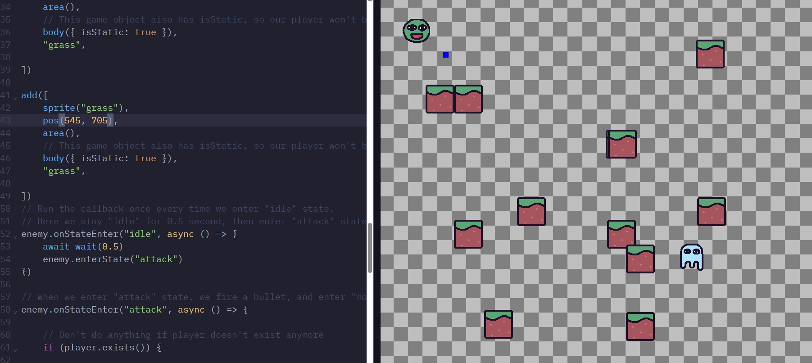
As you can see the blue thing is the bullet and the ghost is shooting it. So this is what I did for LL2 and a game where you run around until he kills you. I will probably make this better and more fun for the future. Where you have to fight a boss to shoot at you. This is something I will do later for LL3.


### LL3
### 11/10/24

I learned a little bit of code for LL3. The first code I learned  for LL3 is.
`````
player.onGround(() => {
	debug.log("ouch")
})
`````
What this does is allow a text to pop up when you touch the ground. Another code I learned is
`````
onKeyPress("space", () => {
	if (player.isGrounded()) {
		player.jump(JUMP_FORCE)
		player.play("jump")
	}
})
`````
When you jump on the top left it will show you jump. Another code is
`````
	anims: {
		"idle": {
			// Starts from frame 0, ends at frame 3
			from: 0,
			to: 3,
			// Frame per second
			speed: 5,
			loop: true,
		},
		"run": {
			from: 4,
			to: 7,
			speed: 10,
			loop: true,
		},
		// This animation only has 1 frame
		"jump": 8,
	},
})
`````
What this code does is that when there is idle the frame will be an amount, if it is jump it will be 8 and if you are running it between 4-7.

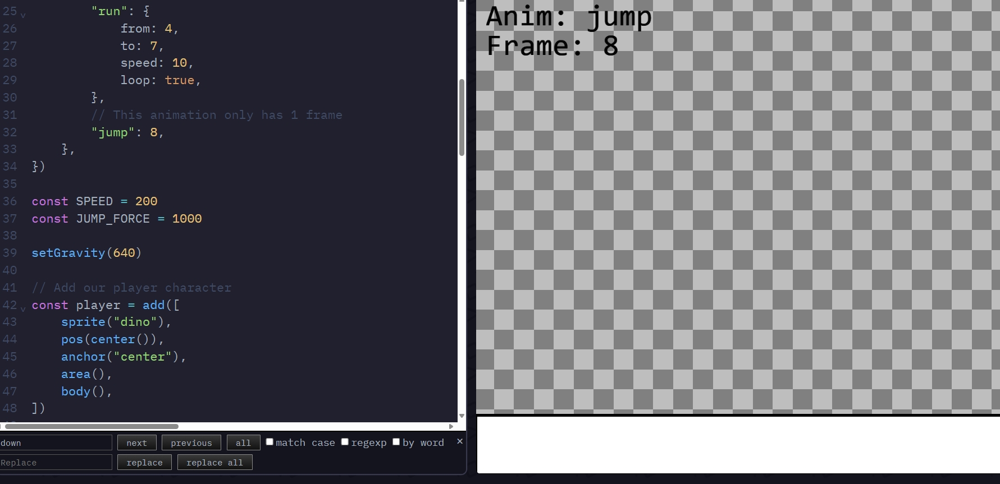
As you can see it shows that the frame is 8 and that the character is jumping.

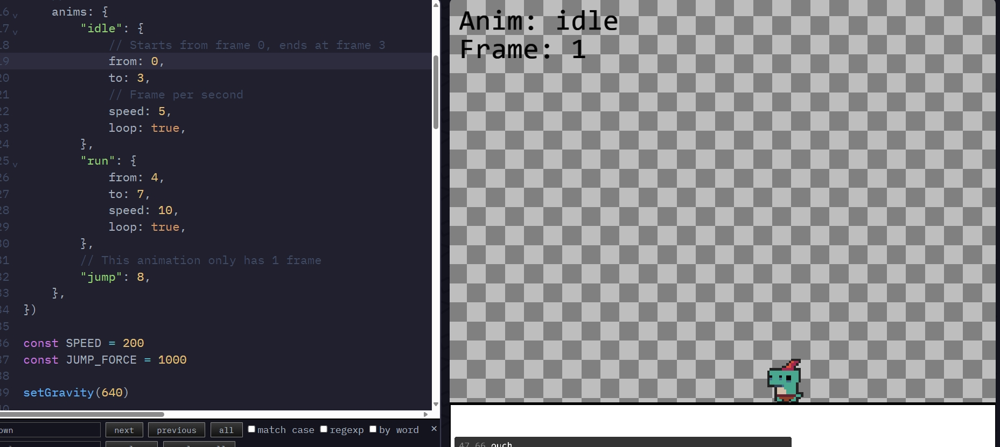
As you can see in this, it shows that it is idle and the frame is 0-4 and that it says ouch after they touch the ground. These were the codes I learned for LL3 and I will be learning more for LL4.

# LL4
## 11/24/24

For LL4 I was able to make levels. The code for this is.
`````js
	const characters = {
		"a": {
			sprite: "bag",
			msg: "Hi Bean! You should get that key!",
		},
		"b": {
			sprite: "ghosty",
			msg: "Who are you? You can see me??",
		},
	}
`````
So This code makes it so you can talk to people in the levels and what they say.


`````js
	// level layouts
	const levels = [
		[
			"===|====",
			"=      =",
			"= $    =",
			"=    a =",
			"=      =",
			"=   @  =",
			"========",
		],
		[
			"--------",
			"-      -",
			"-   $  -",
			"|      -",
			"-    b -",
			"-  @   -",
			"--------",
		],
		[		
			"========",
		    "=      =",
			"= $    =",
			"=    a =",
			"|      =",
			"=   @  =",
			"========",
		],
	]

	const level = addLevel(levels[levelIdx], {
		tileWidth: 64,
		tileHeight: 64,
		pos: vec2(64, 64),
		tiles: {
			"=": () => [
				sprite("grass"),
				area(),
				body({ isStatic: true }),
				anchor("center"),
			],
			"-": () => [
				sprite("steel"),
				area(),
				body({ isStatic: true }),
				anchor("center"),
			],
			"$": () => [
				sprite("key"),
				area(),
				anchor("center"),
				"key",
			],
			"@": () => [
				sprite("bean"),
				area(),
				body(),
				anchor("center"),
				"player",
			],
			"|": () => [
				sprite("door"),
				area(),
				body({ isStatic: true }),
				anchor("center"),
				"door",
			],
		},
  `````
this code makes it so we give something a variable and make it connect back to the levels. We can give them width and height. We make an outline for everything and use the symbols to give it a value. like - is steel and other stuff is different sprite.

The whole code is:
```````js
// simple rpg style walk and talk

kaboom({
	background: [74, 48, 82],
})

loadSprite("bag", "/sprites/bag.png")
loadSprite("ghosty", "/sprites/ghosty.png")
loadSprite("grass", "/sprites/grass.png")
loadSprite("steel", "/sprites/steel.png")
loadSprite("door", "/sprites/door.png")
loadSprite("key", "/sprites/key.png")
loadSprite("bean", "/sprites/bean.png")

scene("main", (levelIdx) => {

	const SPEED = 320

	// character dialog data
	const characters = {
		"a": {
			sprite: "bag",
			msg: "Hi Bean! You should get that key!",
		},
		"b": {
			sprite: "ghosty",
			msg: "Who are you? You can see me??",
		},
	}

	// level layouts
	const levels = [
		[
			"===|====",
			"=      =",
			"= $    =",
			"=    a =",
			"=      =",
			"=   @  =",
			"========",
		],
		[
			"--------",
			"-      -",
			"-   $  -",
			"|      -",
			"-    b -",
			"-  @   -",
			"--------",
		],
		[		
			"========",
		    "=      =",
			"= $    =",
			"=    a =",
			"|      =",
			"=   @  =",
			"========",
		],
	]

	const level = addLevel(levels[levelIdx], {
		tileWidth: 64,
		tileHeight: 64,
		pos: vec2(64, 64),
		tiles: {
			"=": () => [
				sprite("grass"),
				area(),
				body({ isStatic: true }),
				anchor("center"),
			],
			"-": () => [
				sprite("steel"),
				area(),
				body({ isStatic: true }),
				anchor("center"),
			],
			"$": () => [
				sprite("key"),
				area(),
				anchor("center"),
				"key",
			],
			"@": () => [
				sprite("bean"),
				area(),
				body(),
				anchor("center"),
				"player",
			],
			"|": () => [
				sprite("door"),
				area(),
				body({ isStatic: true }),
				anchor("center"),
				"door",
			],
		},
		// any() is a special function that gets called everytime there's a
		// symbol not defined above and is supposed to return what that symbol
		// means
		wildcardTile(ch) {
			const char = characters[ch]
			if (char) {
				return [
					sprite(char.sprite),
					area(),
					body({ isStatic: true }),
					anchor("center"),
					"character",
					{ msg: char.msg },
				]
			}
		},
	})

	// get the player game obj by tag
	const player = level.get("player")[0]

	function addDialog() {
		const h = 160
		const pad = 16
		const bg = add([
			pos(0, height() - h),
			rect(width(), h),
			color(0, 0, 0),
			z(100),
		])
		const txt = add([
			text("", {
				width: width(),
			}),
			pos(0 + pad, height() - h + pad),
			z(100),
		])
		bg.hidden = true
		txt.hidden = true
		return {
			say(t) {
				txt.text = t
				bg.hidden = false
				txt.hidden = false
			},
			dismiss() {
				if (!this.active()) {
					return
				}
				txt.text = ""
				bg.hidden = true
				txt.hidden = true
			},
			active() {
				return !bg.hidden
			},
			destroy() {
				bg.destroy()
				txt.destroy()
			},
		}
	}

	let hasKey = false
	const dialog = addDialog()

	player.onCollide("key", (key) => {
		destroy(key)
		hasKey = true
	})

	player.onCollide("door", () => {
		if (hasKey) {
			if (levelIdx + 1 < levels.length) {
				go("main", levelIdx + 1)
			} else {
				go("win")
			}
		} else {
			dialog.say("you got no key!")
		}
	})

	// talk on touch
	player.onCollide("character", (ch) => {
		dialog.say(ch.msg)
	})

	const dirs = {
		"left": LEFT,
		"right": RIGHT,
		"up": UP,
		"down": DOWN,
	}

	for (const dir in dirs) {
		onKeyPress(dir, () => {
			dialog.dismiss()
		})
		onKeyDown(dir, () => {
			player.move(dirs[dir].scale(SPEED))
		})
	}

})

scene("win", () => {
	add([
		text("You Win!"),
		pos(width() / 2, height() / 2),
		anchor("center"),
	])
})

go("main", 0)
```````


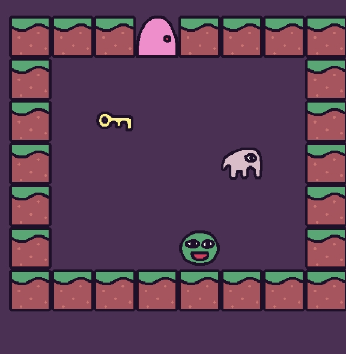
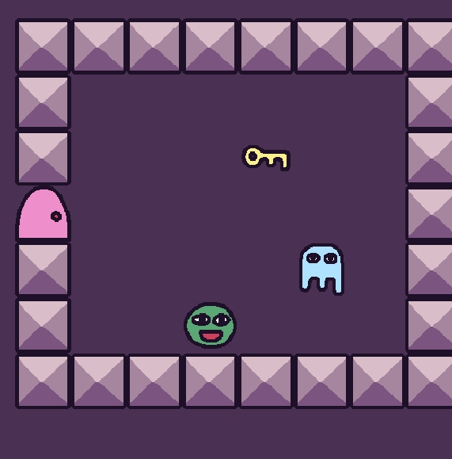
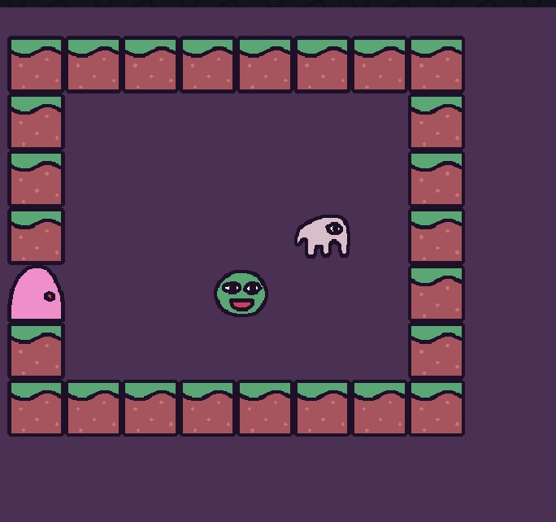

This is what I did for LL4. We made a RPG game where you can explore and talk to the npc and roam.


## LL5
## 12/8/24

Just like css where you have things like hover, in java and in kaboom there is a code where you hover. There are many ways of using this. Where when you hover it will go forever or when you hover it will run once. These are cool things we can do. The code for this is:

`````js

// Only runs once when bean is hovered, and when bean is unhovered
redBean.onHover(() => {
	debug.log("red bean hovered")

	redBean.color = GREEN
})
redBean.onHoverEnd(() => {
	debug.log("red bean unhovered")

	redBean.color = BLUE
})

// Runs every frame when blue bean is hovered
blueBean.onHoverUpdate(() => {
	const t = time() * 10
	blueBean.color = rgb(
		wave(0, 255, t),
		wave(0, 255, t + 2),
		wave(0, 255, t + 4),
	)
`````
These are the two code we can use.

We can use this with a sprite to make a color changing thing when you put your mouse over it.

The whole code is:
`````js
// Differeces between onHover and onHoverUpdate

kaboom({
	// Use logMax to see more messages on debug.log()
	logMax: 5,
})

loadSprite("bean", "/sprites/bean.png")

add([
	text("onHover()\nonHoverEnd()"),
	pos(80, 80),
])

add([
	text("onHoverUpdate()"),
	pos(340, 80),
])

const redBean = add([
	sprite("bean"),
	color(RED),
	pos(130, 180),
	anchor("center"),
	area(),
])

const blueBean = add([
	sprite("bean"),
	color(BLUE),
	pos(380, 180),
	anchor("center"),
	area(),
])

// Only runs once when bean is hovered, and when bean is unhovered
redBean.onHover(() => {
	debug.log("red bean hovered")

	redBean.color = GREEN
})
redBean.onHoverEnd(() => {
	debug.log("red bean unhovered")

	redBean.color = BLUE
})

// Runs every frame when blue bean is hovered
blueBean.onHoverUpdate(() => {
	const t = time() * 10
	blueBean.color = rgb(
		wave(0, 255, t),
		wave(0, 255, t + 2),
		wave(0, 255, t + 4),
	)

	debug.log("blue bean on hover")
})
`````
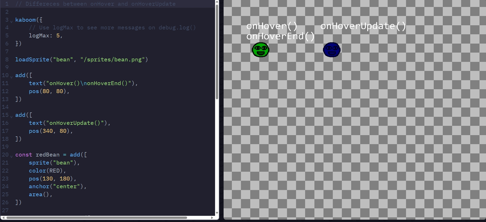
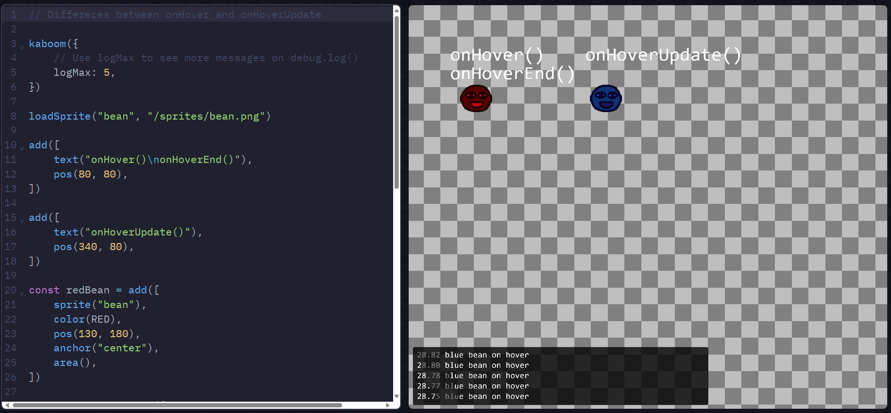


<!-- 
* Links you used today (websites, videos, etc)
* Things you tried, progress you made, etc
* Challenges, a-ha moments, etc
* Questions you still have
* What you're going to try next
-->


